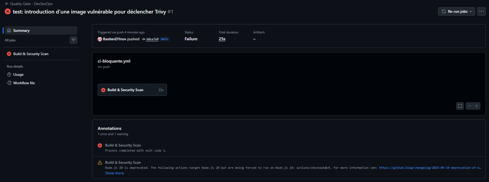

# 08. Kyverno + Terraform + pipeline CI complète

# Glossaire :

- Kube-linter : Un outil d'analyse statique pour tes fichiers YAML Kubernetes et tes charts Helm. Il vérifie que tes configurations respectent les bonnes pratiques (pas de conteneurs privilégiés, limites de ressources définies, etc.) avant même le déploiement.
- Checkov : Outil d'analyse statique (IaC - Infrastructure as Code). Il scanne tes fichiers Terraform pour détecter des erreurs de configuration liées à la sécurité et à la conformité avant le provisionnement.
- Semgrep (SAST) : Il analyse le code source de ton application pour trouver des failles de sécurité (injections SQL, mots de passe en dur) sans avoir besoin d'exécuter le code.
- Trivy (CVE) : Outil de scan de vulnérabilités. Il inspecte tes images de conteneurs (Docker) pour trouver des failles connues (CVE) dans les paquets de l'OS ou les dépendances applicatives.
- ZAP baseline (DAST) : Fourni par l'OWASP, il attaque ton application web en cours d'exécution de l'extérieur (comme un hacker le ferait) pour détecter des vulnérabilités (XSS, configurations HTTP non sécurisées).
- Cosign (sign) : Fait partie du projet Sigstore. Il permet de signer cryptographiquement tes images de conteneurs et de vérifier cette signature avant leur exécution, garantissant qu'elles n'ont pas été altérées.
- Harbor : Harbor est un registre d'images de conteneurs open source qui permet de stocker, signer et analyser des images Docker
- Terraform : Terraform est un outil d'infrastructure as code (IaC) qui automatise le provisionnement et la gestion de l'infrastructure.
- Kind : Outil permettant de faire tourner des clusters Kubernetes locaux en utilisant des conteneurs Docker comme "nœuds". C'est idéal pour l'intégration continue (CI) car c'est léger, rapide à instancier et à détruire.
- Prometheus : c’est un logiciel libre de surveillance informatique et générateur d'alertes. Il enregistre des métriques en temps réel dans une base de données de séries temporelles en se basant sur le contenu de point d'entrée exposé à l'aide du protocole HTTP.

---

# Les 6 règles Kyverno déployées par Terraform

Ajout du label par défaut :

```yaml
# add-default-label.yaml
apiVersion: kyverno.io/v1
kind: ClusterPolicy
metadata:
  name: add-default-label
spec:
  rules:
  - name: add-label
    match:
      any:
      - resources:
          kinds:
          - Pod
    mutate:
      patchStrategicMerge:
        metadata:
          labels:
            +(managed-by): kyverno
```

Interdire le tag "latest" pour le choix d’image :

```yaml
# disallow-latest-tag.yaml
apiVersion: kyverno.io/v1
kind: ClusterPolicy
metadata:
  name: disallow-latest-tag
spec:
  validationFailureAction: Enforce # Bloque le déploiement
  rules:
  - name: require-image-tag
    match:
      any:
      - resources:
          kinds:
          - Pod
    validate:
      message: "L'utilisation du tag 'latest' est interdite."
      pattern:
        spec:
          containers:
          - image: "*:!latest"
```

Interdire les conteneurs privilégiés :

```yaml
# disallow-privileged.yaml
apiVersion: kyverno.io/v1
kind: ClusterPolicy
metadata:
  name: disallow-privileged
spec:
  validationFailureAction: Enforce
  rules:
  - name: check-privileged
    match:
      any:
      - resources:
          kinds:
          - Pod
    validate:
      message: "Les conteneurs privilégiés ne sont pas autorisés."
      pattern:
        spec:
          containers:
          - =(securityContext):
              =(privileged): "false"
```

Génération de la NetworkPolicy par défaut : 

```yaml
# generate-network-policy.yaml
apiVersion: kyverno.io/v1
kind: ClusterPolicy
metadata:
  name: generate-default-deny
spec:
  rules:
  - name: generate-networkpolicy
    match:
      any:
      - resources:
          kinds:
          - Namespace
    generate:
      apiVersion: networking.k8s.io/v1
      kind: NetworkPolicy
      name: default-deny-ingress
      namespace: "{{request.object.metadata.name}}"
      synchronize: true
      data:
        spec:
          podSelector: {}
          policyTypes:
          - Ingress
```

Génération du Quota de ressources :

```yaml
# generate-quota.yaml
apiVersion: kyverno.io/v1
kind: ClusterPolicy
metadata:
  name: generate-default-quota
spec:
  rules:
  - name: generate-quota
    match:
      any:
      - resources:
          kinds:
          - Namespace
    generate:
      apiVersion: v1
      kind: ResourceQuota
      name: default-quota
      namespace: "{{request.object.metadata.name}}"
      synchronize: true
      data:
        spec:
          hard:
            requests.cpu: "4"
            requests.memory: "8Gi"
            limits.cpu: "8"
            limits.memory: "16Gi"
```

 Injection des limites de ressources :

```yaml
# mutate-resources.yaml
apiVersion: kyverno.io/v1
kind: ClusterPolicy
metadata:
  name: default-resources
spec:
  rules:
  - name: inject-resources
    match:
      any:
      - resources:
          kinds:
          - Pod
    mutate:
      patchStrategicMerge:
        spec:
          containers:
          - (name): "*"
            resources:
              +(requests):
                memory: "64Mi"
                cpu: "50m"
              +(limits):
                memory: "256Mi"
                cpu: "200m"
```

# Les tests

## 1. Tester les règles de Validation (Rejet)

Test A : Interdire le tag "latest" (`disallow-latest-tag`)

```bash
kubectl run test-latest --image=nginx:latest
```

Résultat :

```bash
Error from server: admission webhook "validate.kyverno.svc-fail" denied the request:

resource Pod/default/test-latest was blocked due to the following policies

disallow-latest-tag:
  require-image-tag: 'validation error: L''utilisation du tag ''latest'' est interdite.
    rule require-image-tag failed at path /spec/containers/0/image/'
```

Test B : Interdire les conteneurs privilégiés (`disallow-privileged`)

```bash
cat <<EOF | kubectl apply -f -
apiVersion: v1
kind: Pod
metadata:
  name: test-privilegie
spec:
  containers:
  - name: nginx
    image: nginx:1.25
    securityContext:
      privileged: true
EOF
```

Résultat :

```bash
Error from server: error when creating "STDIN": admission webhook "validate.kyverno.svc-fail" denied the request:

resource Pod/default/test-privilegie was blocked due to the following policies

disallow-latest-tag:
  require-image-tag: 'validation error: L''utilisation du tag ''latest'' est interdite.
    rule require-image-tag failed at path /spec/containers/0/image/'
disallow-privileged:
  check-privileged: 'validation error: Les conteneurs privilégiés ne sont pas autorisés.
    rule check-privileged failed at path /spec/containers/0/securityContext/privileged/'
```

## Tester les règles de Mutation

Créer un pod de test:

```bash
kubectl run test-mutate --image=nginx:1.25
```

Test C : Ajout du label par défaut ( `add-default-label` )

```bash
kubectl get pod test-mutate --show-labels
```

Dans la colonne `LABELS`, tu verras que `managed-by=kyverno` a été ajouté automatiquement, en plus du label par défaut `run=test-mutate`.

Test D : Injection des limites de ressources (`mutate-ressources` ) :

```bash
kubectl get pod test-mutate -o jsonpath='{.spec.containers[0].resources}' | jq
```

Résultat :

```bash
{
  "limits": {
    "cpu": "200m",
    "memory": "256Mi"
  },
  "requests": {
    "cpu": "50m",
    "memory": "64Mi"
  }
}
```

## Tester les règles de Génération

Créer un namespace de test :

```bash
kubectl create namespace projet-demo
```

Test E : Génération de la NetworkPolicy par défaut (`generate-network-policy`) : 

```bash
kubectl get networkpolicy -n projet-demo
```

Réulstat :

```bash
NAME                   POD-SELECTOR   AGE
default-deny-ingress   <none>         50s
```

```bash
 kubectl describe networkpolicy default-deny-ingress -n projet-demo
```

Résultat :

```bash
Name:         default-deny-ingress
Namespace:    projet-demo
Created on:   2026-06-24 11:29:00 +0200 CEST
Labels:       app.kubernetes.io/managed-by=kyverno
              generate.kyverno.io/policy-name=generate-default-deny
              generate.kyverno.io/policy-namespace=
              generate.kyverno.io/rule-name=generate-networkpolicy
              generate.kyverno.io/trigger-group=
              generate.kyverno.io/trigger-kind=Namespace
              generate.kyverno.io/trigger-namespace=
              generate.kyverno.io/trigger-uid=ed3e7111-bb0a-49b6-a24c-25c2daa26e31
              generate.kyverno.io/trigger-version=v1
Annotations:  <none>
Spec:
  PodSelector:     <none> (Allowing the specific traffic to all pods in this namespace)
  Allowing ingress traffic:
    <none> (Selected pods are isolated for ingress connectivity)
  Not affecting egress traffic
  Policy Types: Ingress
```

Test F : Génération du Quota de ressources (`generate-quota`) : 

```bash
kubectl get resourcequota -n projet-demo

kubectl describe resourcequota default-quota -n projet-demo
```

Résultat :

```bash
kubectl get resourcequota -n projet-demo
NAME            AGE     REQUEST                                     LIMIT
default-quota   6m18s   requests.cpu: 0/4, requests.memory: 0/8Gi   limits.cpu: 0/8, limits.memory: 0/16Gi

kubectl describe resourcequota default-quota -n projet-demo
Name:            default-quota
Namespace:       projet-demo
Resource         Used  Hard
--------         ----  ----
limits.cpu       0     8
limits.memory    0     16Gi
requests.cpu     0     4
requests.memory  0     8Gi
```

## CI bloquante avec Trivy

Démonstration de la CI "Bloquante" :

Blocage sur GitHub par Trivy en cas de détection de faille de sécurité :

Création de la pipeline CI/CD: 

```bash
mkdir -p .github/workflows

cat << 'EOF' > .github/workflows/ci-bloquante.yml
name: Quality Gate - DevSecOps

on: [push]

jobs:
  build-and-scan:
    name: Build & Security Scan
    runs-on: ubuntu-latest
    steps:
      - name: Checkout du code
        uses: actions/checkout@v4

      - name: Compilation de l'image
        run: docker build -t app-vuln:latest .

      - name: Scan de vulnérabilités avec Trivy
        uses: aquasecurity/trivy-action@master
        with:
          image-ref: 'app-vuln:latest'
          format: 'table'
          exit-code: '1' 
          severity: 'CRITICAL'
EOF
```

Création d’un Dockerfile avec une faille de sécurité :

```bash
cat << 'EOF' > Dockerfile
# Utilisation volontaire d'une image obsolète contenant des failles critiques
FROM debian:10

RUN echo "Démarrage de l'application..."
EOF
```

Ajout et Commit du fichier:

```bash
git add .
git commit -m "test: introduction d'une image vulnérable pour déclencher Trivy"
git branch -M main
```

Push du commit :

```bash
git push -u origin main
```



```bash
Run aquasecurity/trivy-action@master
Run aquasecurity/setup-trivy@81e514348e19b6112ce2a7e3ecbafe19c1e1f567
Run # `path` is passed via env to avoid script injection. As a result, shell
Run actions/cache/restore@9255dc7a253b0ccc959486e2bca901246202afeb
Cache not found for input keys: trivy-binary-v0.71.2-Linux-X64
Run actions/checkout@8e8c483db84b4bee98b60c0593521ed34d9990e8
Syncing repository: aquasecurity/trivy
Getting Git version info
Temporarily overriding HOME='/home/runner/work/_temp/f1674ba2-593b-4962-acc5-9b3233695c3d' before making global git config changes
Adding repository directory to the temporary git global config as a safe directory
/usr/bin/git config --global --add safe.directory /home/runner/work/DevSecOps/DevSecOps/trivy
Initializing the repository
Disabling automatic garbage collection
Setting up auth
Fetching the repository
Determining the checkout info
Setting up sparse checkout
Checking out the ref
/usr/bin/git log -1 --format=%H
75c4dc0f45c5d7ffd05ae26df1e0c666787bdf2a
Run echo "installing Trivy binary"
installing Trivy binary
aquasecurity/trivy info checking GitHub for tag 'v0.71.2'
aquasecurity/trivy info found version: 0.71.2 for v0.71.2/Linux/64bit
aquasecurity/trivy info installed /home/runner/.local/bin/trivy-bin/trivy
Run echo "${BINARY_DIR}" >> "$GITHUB_PATH"
Run actions/cache/save@9255dc7a253b0ccc959486e2bca901246202afeb
/usr/bin/tar --posix -cf cache.tzst --exclude cache.tzst -P -C /home/runner/work/DevSecOps/DevSecOps --files-from manifest.txt --use-compress-program zstdmt
Sent 46112323 of 46112323 (100.0%), 46.2 MBs/sec
Cache saved with key: trivy-binary-v0.71.2-Linux-X64
Run echo "date=$(date +'%Y-%m-%d')" >> $GITHUB_OUTPUT
Run actions/cache@27d5ce7f107fe9357f9df03efb73ab90386fccae
Cache not found for input keys: cache-trivy-2026-06-24, cache-trivy-
Run echo "$GITHUB_ACTION_PATH" >> $GITHUB_PATH
Run rm -f trivy_envs.txt
Run # Note: There is currently no way to distinguish between undefined variables and empty strings in GitHub Actions.
Run entrypoint.sh
Running Trivy with options: trivy image app-vuln:latest
2026-06-24T11:49:27Z	INFO	[vulndb] Need to update DB
2026-06-24T11:49:27Z	INFO	[vulndb] Downloading vulnerability DB...
2026-06-24T11:49:27Z	INFO	[vulndb] Downloading artifact...	repo="mirror.gcr.io/aquasec/trivy-db:2"
1.69 MiB / 97.14 MiB [->_____________________________________________________________] 1.74% ? p/s ?23.03 MiB / 97.14 MiB [-------------->______________________________________________] 23.71% ? p/s ?55.52 MiB / 97.14 MiB [---------------------------------->__________________________] 57.15% ? p/s ?88.72 MiB / 97.14 MiB [------------------------------------------>____] 91.33% 145.09 MiB p/s ETA 0s97.14 MiB / 97.14 MiB [--------------------------------------------->] 100.00% 145.09 MiB p/s ETA 0s97.14 MiB / 97.14 MiB [--------------------------------------------->] 100.00% 145.09 MiB p/s ETA 0s97.14 MiB / 97.14 MiB [--------------------------------------------->] 100.00% 136.63 MiB p/s ETA 0s97.14 MiB / 97.14 MiB [--------------------------------------------->] 100.00% 136.63 MiB p/s ETA 0s97.14 MiB / 97.14 MiB [--------------------------------------------->] 100.00% 136.63 MiB p/s ETA 0s97.14 MiB / 97.14 MiB [--------------------------------------------->] 100.00% 127.81 MiB p/s ETA 0s97.14 MiB / 97.14 MiB [--------------------------------------------->] 100.00% 127.81 MiB p/s ETA 0s97.14 MiB / 97.14 MiB [--------------------------------------------->] 100.00% 127.81 MiB p/s ETA 0s97.14 MiB / 97.14 MiB [--------------------------------------------->] 100.00% 119.57 MiB p/s ETA 0s97.14 MiB / 97.14 MiB [--------------------------------------------->] 100.00% 119.57 MiB p/s ETA 0s97.14 MiB / 97.14 MiB [--------------------------------------------->] 100.00% 119.57 MiB p/s ETA 0s97.14 MiB / 97.14 MiB [--------------------------------------------->] 100.00% 111.85 MiB p/s ETA 0s97.14 MiB / 97.14 MiB [-------------------------------------------------] 100.00% 31.01 MiB p/s 3.3s2026-06-24T11:49:32Z	INFO	[vulndb] Artifact successfully downloaded	repo="mirror.gcr.io/aquasec/trivy-db:2"
2026-06-24T11:49:32Z	INFO	[vuln] Vulnerability scanning is enabled
2026-06-24T11:49:32Z	INFO	[secret] Secret scanning is enabled
2026-06-24T11:49:32Z	INFO	[secret] If your scanning is slow, please try '--scanners vuln' to disable secret scanning
2026-06-24T11:49:32Z	INFO	[secret] Please see https://trivy.dev/docs/v0.71/guide/scanner/secret#recommendation for faster secret detection
2026-06-24T11:49:36Z	INFO	Detected OS	family="debian" version="10.13"
2026-06-24T11:49:36Z	INFO	[debian] Detecting vulnerabilities...	os_version="10" pkg_num=91
2026-06-24T11:49:36Z	INFO	Number of language-specific files	num=0
2026-06-24T11:49:36Z	WARN	Using severities from other vendors for some vulnerabilities. Read https://trivy.dev/docs/v0.71/guide/scanner/vulnerability#severity-selection for details.
2026-06-24T11:49:36Z	WARN	This OS version is no longer supported by the distribution	family="debian" version="10.13"
2026-06-24T11:49:36Z	WARN	The vulnerability detection may be insufficient because security updates are not provided

Report Summary

┌────────────────────────────────┬────────┬─────────────────┬─────────┐
│             Target             │  Type  │ Vulnerabilities │ Secrets │
├────────────────────────────────┼────────┼─────────────────┼─────────┤
│ app-vuln:latest (debian 10.13) │ debian │        2        │    -    │
└────────────────────────────────┴────────┴─────────────────┴─────────┘
Legend:
- '-': Not scanned
- '0': Clean (no security findings detected)

For OSS Maintainers: VEX Notice
--------------------------------
If you're an OSS maintainer and Trivy has detected vulnerabilities in your project that you believe are not actually exploitable, consider issuing a VEX (Vulnerability Exploitability eXchange) statement.
VEX allows you to communicate the actual status of vulnerabilities in your project, improving security transparency and reducing false positives for your users.
Learn more and start using VEX: https://trivy.dev/docs/v0.71/guide/supply-chain/vex/repo#publishing-vex-documents

To disable this notice, set the TRIVY_DISABLE_VEX_NOTICE environment variable.

app-vuln:latest (debian 10.13)
==============================
Total: 2 (CRITICAL: 2)

┌──────────┬────────────────┬──────────┬──────────────┬─────────────────────────┬───────────────┬────────────────────────────────────────────────────────┐
│ Library  │ Vulnerability  │ Severity │    Status    │    Installed Version    │ Fixed Version │                         Title                          │
├──────────┼────────────────┼──────────┼──────────────┼─────────────────────────┼───────────────┼────────────────────────────────────────────────────────┤
│ libdb5.3 │ CVE-2019-8457  │ CRITICAL │ will_not_fix │ 5.3.28+dfsg1-0.5        │               │ sqlite: heap out-of-bound read in function rtreenode() │
│          │                │          │              │                         │               │ https://avd.aquasec.com/nvd/cve-2019-8457              │
├──────────┼────────────────┤          │              ├─────────────────────────┼───────────────┼────────────────────────────────────────────────────────┤
│ zlib1g   │ CVE-2023-45853 │          │              │ 1:1.2.11.dfsg-1+deb10u2 │               │ zlib: integer overflow and resultant heap-based buffer │
│          │                │          │              │                         │               │ overflow in zipOpenNewFileInZip4_6                     │
│          │                │          │              │                         │               │ https://avd.aquasec.com/nvd/cve-2023-45853             │
└──────────┴────────────────┴──────────┴──────────────┴─────────────────────────┴───────────────┴────────────────────────────────────────────────────────┘
Error: Process completed with exit code 1.
Run rm -f trivy_envs.txt
```